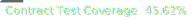

2025-Sui-Hacker-House-template 
---

This template is a material for the [slides](https://slides.com/yanganto/dive-into-move-on-sui) in the following events.
- 2025 Mar 28 Tokyo Sui Hacker House
- 2025 Feb 21 Shenzhen Sui Hacker House 
- 2024 Dec 16 Taiwan Builder House 
- 2024 Dec 12 Taipei Blockchain Week

### How to use

This is a move template for you easy to try move to write a contract, and the CI and dev environment already setup.
- Click the button use this template
- Put your ideal in `source/template.move`
- Open a PR to your project and the CI will lint, test, and calculate the test coverage for your package.

### How to turn my ideal into a real one

This template is ready to deploy as you wish.
If you want to change the project name, just rename following
- `name` field of `[package]` section in `Move.toml`
- `template` field of `[address]` section in `Move.toml`
- rename the file `template.move` and the `module` name in the top of the file
Please reference this [PR](https://github.com/yanganto/GororoWarranty/pull/1)
